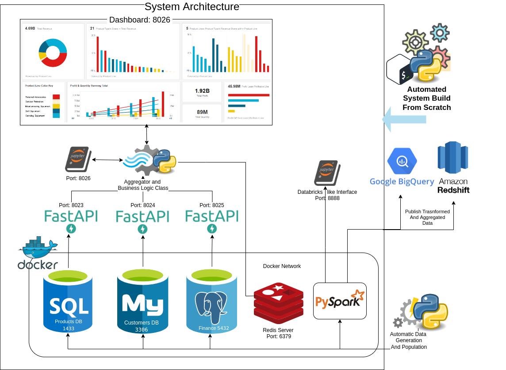

# SQL of all flavors, MicroServices, Pyspark, and Flask Dashboards using Altair, and custom Excel spreadsheets.

This solution shows a little bit of everything, like what we may expect to find in an environment where data is dispersed between different data stores.




## Pre-Requeisites

This system is tested on a linux box (Ubuntu 22.04).

To check if your system has correct dependencies.

* Clone the repo
* Run chk_deps.sh


Example:
```
git clone https://github.com/Don-Irwin/sql_all_flv_microsvc_pyspark  && cd ./sql_all_flv_microsvc_pyspark  && . chk_deps.sh
```

## Running the System Out of the Gate

```
git clone https://github.com/Don-Irwin/sql_all_flv_microsvc_pyspark  && cd ./sql_all_flv_microsvc_pyspark  && . chk_deps.sh
```
